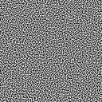

# Dither 3D - Camera-Sphere Mapped Blue Noise Dithering

A Three.js demo showcasing camera-sphere mapped blue noise dithering, inspired by the visual style of **Return of the Obra Dinn** by Lucas Pope.



## Overview

This project demonstrates a unique dithering technique where the dither pattern is mapped to an invisible sphere centered around the camera. This creates a distinctive visual effect where:

- The dither pattern remains **stable during camera rotation** (doesn't slide over geometry)
- The dither pattern **moves with camera translation** (maintains relationship to camera position)
- The scene is rendered in **black and white** with dithering creating shades of gray

This is the same technique Lucas Pope used in *Return of the Obra Dinn*, as described in his [devlog posts](https://forums.tigsource.com/index.php?topic=40832.msg1363742#msg1363742).

## Installation

```bash
npm install
```

## Usage

### Development Mode

Start the development server:

```bash
npm run dev
```

The application will automatically open in your browser at `http://localhost:3000`.

### Build for Production

```bash
npm run build
```

### Preview Production Build

```bash
npm run preview
```

## Controls

### Camera Controls

**Orbit Mode (Default)**:
- **Left Mouse Button + Drag**: Rotate camera around scene
- **Right Mouse Button + Drag**: Pan camera
- **Mouse Wheel**: Zoom in/out

**Fly Mode** (toggle in Leva panel):
- **W / Arrow Up**: Move forward
- **S / Arrow Down**: Move backward
- **A / Arrow Left**: Strafe left
- **D / Arrow Right**: Strafe right
- **Space**: Move up
- **Shift**: Move down
- **Mouse**: Look around (click to lock pointer)
- **ESC**: Unlock pointer

### Visual Settings (Leva Panel)

- **Fly Mode**: Toggle between orbit controls and free-fly WASD controls
- **Camera Sphere Radius**: Controls the radius of the invisible sphere around the camera that the dither pattern is mapped to (1.0 - 50.0)
- **Pattern Scale**: Controls the tiling/scale of the blue noise pattern on the sphere (1.0 - 100.0)
- **Threshold Bias**: Adjusts the brightness threshold for the dithering effect (0.0 - 1.0)

## How It Works

### Camera-Sphere Mapping Technique

1. **World Position Reconstruction**: For each pixel on screen, the shader reconstructs the 3D world position using the depth buffer
2. **Direction Calculation**: Calculates the direction vector from the camera to the world position
3. **Sphere Mapping**: Projects this direction onto an invisible sphere of configurable radius centered at the camera
4. **Spherical UV Coordinates**: Converts the sphere position to UV coordinates using spherical mapping
5. **Blue Noise Sampling**: Samples the blue noise texture using these UV coordinates (with tiling)
6. **Threshold Comparison**: Converts the scene color to grayscale and compares it against the blue noise value
7. **Binary Output**: Outputs pure black or white based on the comparison

This technique ensures the dither pattern is "pinned" to directions relative to the camera, making it stable during rotation but not translation.

### Scene Objects

The demo includes various test geometries:
- **Sphere** (central)
- **Cone**
- **Cubes/Blocks** (various sizes and positions)
- **Torus**
- **Cylinder**
- **Ground plane**

## Technical Stack

- **React** - UI framework
- **Three.js** - 3D rendering engine
- **React Three Fiber** - React renderer for Three.js
- **React Three Drei** - Useful helpers for R3F
- **React Three Postprocessing** - Post-processing effects
- **Leva** - Control panel for tweaking parameters
- **Vite** - Build tool and dev server
- **TypeScript** - Type safety

## Shader Details

The dithering is implemented as a post-processing shader effect that:
- Uses the depth buffer to reconstruct world positions
- Maps the blue noise texture to a sphere around the camera
- Performs threshold comparison for black/white output
- Runs entirely on the GPU for real-time performance

## Blue Noise Texture

The project uses a blue noise texture (`blue-noise.png`) which provides better perceptual quality than ordered dithering (Bayer matrix) or white noise. Blue noise distributes errors in the high-frequency domain, avoiding visible patterns and banding artifacts.

## Credits

- Dithering technique inspired by [Return of the Obra Dinn](https://obradinn.com/) by Lucas Pope
- Blue noise dithering concept explained in Lucas Pope's [devlog](https://forums.tigsource.com/index.php?topic=40832.0)

## License

ISC
